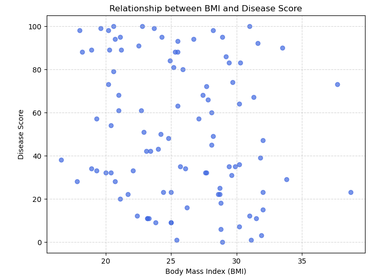
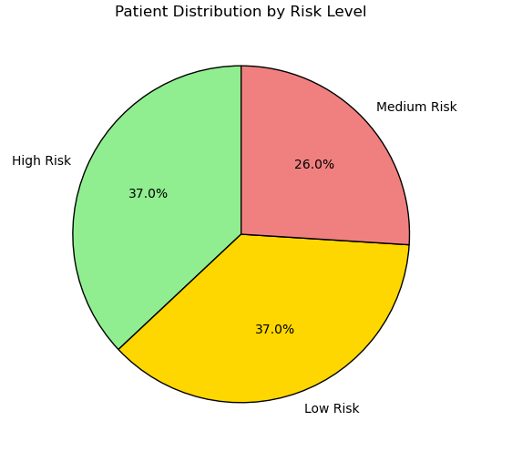
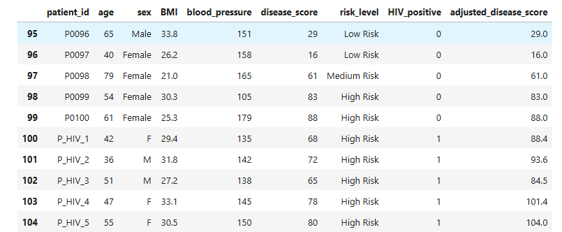

🏥 CareTrack – Patient Risk Triage Analysis (Rural Clinic)

CareTrack is a public health initiative supporting rural clinics across South Africa.
One clinic in the Eastern Cape operates without a full-time doctor, relying on nurses and volunteers to make fast, high-stakes triage decisions.

This project uses basic patient health data to identify high-risk patients, support data-driven triage, and demonstrate how simple analytics can improve outcomes in resource-constrained environments.

🧩 The Problem

The clinic collects patient data but lacks:

A consistent way to identify who needs urgent care

Evidence of how BMI and disease severity relate

A clear risk classification system nurses can rely on

With no doctor on site, missed or delayed escalation can be life-threatening.

📊 Data Overview

The dataset contains basic health metrics for each patient:

Age

Sex

Body Mass Index (BMI)

Blood pressure

Disease score (from symptoms and lab results)

To make this data actionable, additional features were engineered:

Risk level (Low / Medium / High)

HIV status

Adjusted disease score (risk amplification for HIV-positive patients)

Cleaned & Enriched Dataset Preview

Why this matters:
The dataset is transformed from raw measurements into a decision-ready triage tool.

🔍 Relationship Between BMI and Disease Severity

To test the clinic’s assumption that higher BMI may correlate with higher disease risk, a scatter plot was created.

Insight:

While BMI alone does not determine risk, patients with higher BMI and high disease scores cluster in the high-risk region

BMI acts as a contributing risk factor, not a standalone diagnosis

This supports the idea that risk must be multi-factor, not single-metric.

🚦 Risk Classification Logic

Patients were classified into three risk levels using a transparent rule-based approach:

Low Risk

Medium Risk

High Risk

Thresholds were derived from the disease score distribution to ensure:

Interpretability

Ease of explanation to non-technical staff

Reproducibility in a clinic setting

📈 Risk Distribution Across Patients

Understanding how many patients fall into each category is critical for staffing and escalation planning.

Key Takeaways:

A significant portion of patients fall into the High Risk category

The clinic must be prepared for frequent urgent escalations

Nurses can use this distribution to prioritise attention and resources

🧠 Feature Engineering: Improving Triage Decisions

To enhance the triage system, a new feature was introduced:

Adjusted Disease Score

HIV-positive patients receive a 30% risk uplift

Reflects higher vulnerability even at similar symptom levels

This adjustment ensures that:

High-risk patients are not underestimated

The system aligns better with real clinical risk

The logic is implemented as a reusable function in src/risk_rules.py.

🧰 Reusable Triage Logic

The project includes reusable Python functions to:

Compute risk thresholds

Classify patients

Apply risk-adjusted scoring

This allows CareTrack to:

Re-run the analysis as new data arrives

Adapt thresholds if clinical guidelines change

Move toward automation-ready triage support

🌍 Real-World Impact

This project demonstrates how simple, explainable analytics can:

Support nurses in the absence of doctors

Reduce decision fatigue

Improve patient outcomes in rural healthcare settings

It is designed to be practical, ethical, and interpretable — not a black-box model.

👤 Author

Muhammed Uwais Adam
Data Analysis | Healthcare Analytics | Risk Classification | Python
